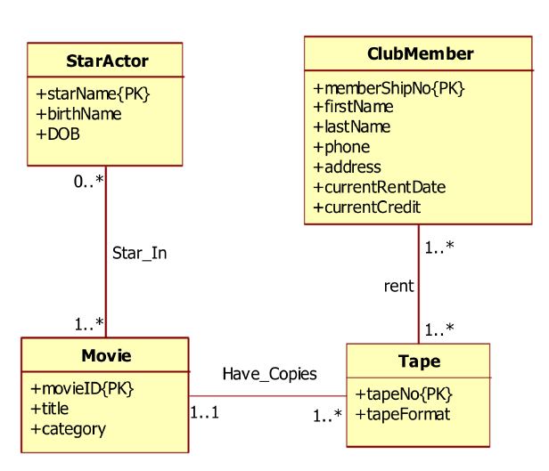

### 200120 월요일 - ERD Module project 


- 3조

  - 탁성건 : Exercise 1

    ```txt
    Domain: Manufacturer
    A manufacturing company produces products. The following product
    information is stored: product name, product ID and quantity on hand. These
    products are made up of many components. Each component can be supplied
    by one or more suppliers. The following component information is kept:
    component ID, name, description, suppliers who supply them, and products in
    which they are used. Use Figure B.1 for this exercise.
    Create an ERD to show how you would track this information.
    Show entity names, primary keys, attributes for each entity, relationships
    between the entities and cardinality.
    
    Assumptions
    a) A supplier can exist without providing components.
    b) A component does not have to be associated with a supplier.
    c) A component does not have to be associated with a product. Not all
    components are used in products.
    d) A product cannot exist without components.
    ```

    

    

    ------

    

  - 이민기 : Exercise 2

    ```txt
    Domain: Car Dealership
    Create an ERD for a car dealership. The dealership sells both new and used
    cars, and it operates a service facility (see Figure B.2). Base your design on
    the following business rules:
    a) A salesperson may sell many cars, but each car is sold by only one
    salesperson.
    b) A customer may buy many cars, but each car is bought by only one
    customer.
    c) A salesperson writes a single invoice for each car he or she sells.
    d) A customer gets an invoice for each car he or she buys.
    e) A customer may come in just to have his or her car serviced; that is, a
    customer need not buy a car to be classified as a customer.
    f) When a customer takes one or more cars in for repair or service, one
    service ticket is written for each car.
    g) The car dealership maintains a service history for each of the cars serviced.
    The service records are referenced by the car’s serial number.
    h) A car brought in for service can be worked on by many mechanics, and
    each mechanic may work on many cars.
    i) A car that is serviced may or may not need parts (e.g., adjusting a
    carburetor or cleaning a fuel injector nozzle does not require providing new
    parts).
    ```

    

    

    ------

    

  - 박상우 : Exercise 3

    ```txt
    Harris’s Pet Store has requested you to design a database to store information
    on sales on animals and merchandises. The sales form is shown in the below.
    Answer questions 1 and 2.
    
    a) Identify all entities and attributes for each entity from the Sales Form in the above. Provide your answer in the following format. 
    
    
    b) Using your answers in Question 1 above, draw a complete conceptual Entity Relationship Model(ERM) to model the data in the Sales Form. Multiplicities and primary keys must be shown on your model.
    ```

    

    

    ------

    

  - 이대희 : Exercise 4

    ```txt
    You are required to create a conceptual data model of the data requirements for a company that specializes in IT training. The Company has 30 instructors and can handle up to 100 trainees per training session. The Company offers five advanced technology courses, each of which is taught by a teaching team of two or more instructors. Each instructor is assigned to a maximum of two teaching teams or may be assigned to do research. Each trainee undertakes one advanced technology course per training session.
    
    a) Identify the main entity types for the company.
    
    b) Identify the main relationship types and specify the multiplicity for each relationship. State any assumptions you make about the data.
    
    c) Using your answers for (a) and (b), draw a single ER diagram to represent the data requirements for the company.
    ```

    

    

    ------

    

  - 이종화 : Exercise 6

    ```txt
    Given the following conceptual ERD, transform it into a logical ERD.
    ```

    

    
